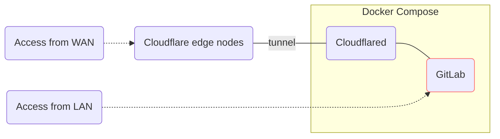

# GitLab Docker Compose

Deploy [GitLab](https://about.gitlab.com/) in your office and access it anywhere.

If you want to self-host GitLab in your office or on-premise data center, and
access from anywhere, with zero cloud cost, you come to the right place. While
this repository is tailored for my use cases, it may help you get started.



## Get Started

- Setup infrastructure by [Terraform](https://github.com/hashicorp/terraform)
  or [OpenTofu](https://github.com/opentofu/opentofu) (see [infra/README.md](./infra/README.md)).
- Config environment variables in `.env` file (refer to [example.env](./example.env)).
- Setup docker macvlan network by [./scripts/setup-network.sh](./scripts/setup-network.sh).
- Run `docker compose up -d` to spin up services.

## File Notes

- [gitlab.rb](./gitlab.rb) is duplicated from */opt/gitlab/etc/gitlab.rb.template*
(version v18.1.2-ee), as a handy reference.
- [setup-network.sh](./scripts/setup-network.sh) demonstrates how to create a
  docker network with the
  [macvlan](https://docs.docker.com/network/drivers/macvlan/) driver type.
- [example.env](./example.env) is a template which is expected to be copied as
the `.env` file and edited further.

## Cloudflare Tunnels

[Cloudflare Tunnel](https://developers.cloudflare.com/cloudflare-one/connections/connect-networks/)
provides a secure way to host without a public IP address.
It's recommended to set up infrastructures like Cloudflare Tunnel by [Terraform](https://www.terraform.io/).
Read more in [infra/README.md](./infra/README.md).

## Feature Flags

On self-hosted GitLab, you may choose to enable or disable certain [feature flags](https://docs.gitlab.com/ee/user/feature_flags).
Refer to GitLab Docs:
[Enable and disable GitLab features deployed behind feature flags](https://docs.gitlab.com/ee/administration/feature_flags).
Here's a quick note:

```sh
# enter interactive tty of gitlab container.
docker compose exec -it gitlab bash
# enter gitlab-rails console (this command may take several minutes).
sudo gitlab-rails console
```

<!-- markdownlint-disable MD033 -->
<details><summary>Commonly used commands in gitlab-rails console</summary>

```ruby
# enable "example_feature" feature flag.
Feature.enable(:example_feature)
# check if "example_feature" is enabled.
Feature.enabled?(:example_feature)
# disable "example_feature" feature flag.
Feature.disable(:example_feature)
# unset "example_feature" so that GitLab falls back to the default.
Feature.remove(:example_feature)
```

</details>
<!-- markdownlint-enable MD033 -->

## Admin Settings

Disable [event data tracking](https://docs.gitlab.com/administration/settings/event_data/).
