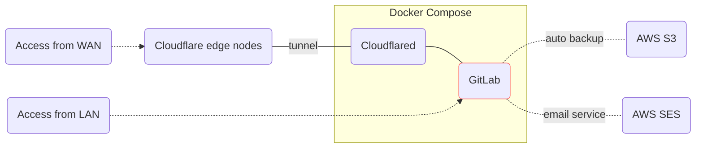

# GitLab Docker Compose

[](https://about.gitlab.com/)
[](https://github.com/whisperpine/gitlab-compose/blob/main/LICENSE)
[](https://github.com/whisperpine/gitlab-compose/actions/workflows/checks.yml)
[](https://github.com/whisperpine/gitlab-compose/deployments/infra-default)
[](https://github.com/whisperpine/gitlab-compose/releases)

Self-host [GitLab](https://about.gitlab.com/) in your office and access it everywhere.

If you want to self-host GitLab in your office or on-premise data center, and
access from anywhere, with zero cloud cost, you come to the right place. While
this repository is tailored for my use cases, it may help you get started.



## Background

When developing game projects with large binary files (e.g., textures, audio
clips) ranging from several to tens of GBs, [Git LFS](https://git-lfs.com/) is
the ideal solution for tracking these files. Our team heavily relied on CI/CD
pipelines, which generated significant network traffic between the repository
and CI runner. These pipelines also required computational resources due to long
compile times, making a self-hosted CI runner on a powerful device preferable.
Therefore hosting both the Git server and CI runner within the same subnet
reduces network latency and financial costs.

Using GitHub was not ideal due to expensive LFS storage and outbound bandwidth
(refer to [GitHub LFS Pricing](https://docs.github.com/en/billing/concepts/product-billing/git-lfs)),
as well as prolonged CI/CD times caused by cloning repositories to a device with
a self-hosted GitHub runner.

To address this, I came up with this solution: a self-hosted GitLab server and
GitLab runner in our office, within the same subnet, while maintaining global
accessibility using Cloudflare Tunnels.

## Get Started

- Setup infrastructure by [Terraform](<https://github.com/hashicorp/terraform>)
  or [OpenTofu](https://github.com/opentofu/opentofu) (see [infra/README.md](./infra/README.md)).
- Config environment variables in `.env` file (refer to [example.env](./example.env)).
- Setup docker macvlan network by [./scripts/setup-network.sh](./scripts/setup-network.sh).
- Run `docker compose up -d` to spin up services.

## Cloud Services

While it's easy to spin up a standalone GitLab instance via docker compose, it's
essential to manage dependent cloud services properly, to make it
production-ready. These services are managed by OpenTofu in this repo.

- [AWS S3](https://aws.amazon.com/s3/):
  provides an S3 bucket used by GitLab to periodically upload backups.
- [AWS SES](https://aws.amazon.com/ses/):
  provides an SMTP server which is used by GitLab to send emails.
- [Cloudflare Tunnel](https://developers.cloudflare.com/cloudflare-one/connections/connect-networks/):
  provides a secure way to host without a public IP address.

## File Notes

- [gitlab.rb](./gitlab.rb) is duplicated from */opt/gitlab/etc/gitlab.rb.template*
(version v18.1.2-ee), as a handy reference.
- [setup-network.sh](./scripts/setup-network.sh) demonstrates how to create a
  docker network with the
  [macvlan](https://docs.docker.com/network/drivers/macvlan/) driver type.
- [example.env](./example.env) is a template which is expected to be copied as
the `.env` file and edited further.

## Feature Flags

On self-hosted GitLab, you may choose to enable or disable certain [feature flags](https://docs.gitlab.com/ee/user/feature_flags).
Refer to GitLab Docs:
[Enable and disable GitLab features deployed behind feature flags](https://docs.gitlab.com/ee/administration/feature_flags).
Here's a quick note:

```sh
# enter interactive tty of gitlab container.
docker compose exec -it gitlab bash
# enter gitlab-rails console (this command may take several minutes).
sudo gitlab-rails console
```

<!-- markdownlint-disable MD033 -->
<details><summary>Commonly used commands in gitlab-rails console</summary>

```ruby
# enable "example_feature" feature flag.
Feature.enable(:example_feature)
# check if "example_feature" is enabled.
Feature.enabled?(:example_feature)
# disable "example_feature" feature flag.
Feature.disable(:example_feature)
# unset "example_feature" so that GitLab falls back to the default.
Feature.remove(:example_feature)
```

</details>
<!-- markdownlint-enable MD033 -->

## Admin Settings

Disable [event data tracking](https://docs.gitlab.com/administration/settings/event_data/).
